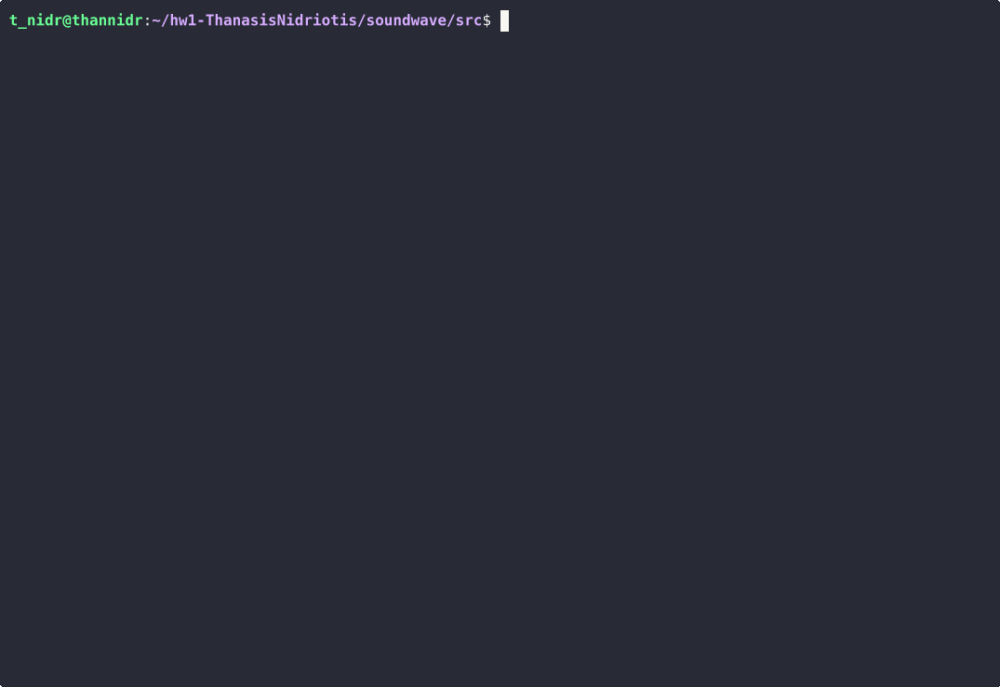

# The Soundwave program
Welcome to the ReadMe for the Soundwave program!

This program was created in order to do a variety of functions and edit and utilize [wav](https://en.wikipedia.org/wiki/WAV) files in a number of different ways.

### Table of contents
- [1. What is a Wav/WAVE file?](#questionwhat-is-a-wavwave-file)
- [2.What does this program accomplish?](#what-does-this-program-accomplish)
    - [:clipboard:Info](#clipboard-info)
        - [How to run info](#how-to-run-info)
    - [:timer_clock:Rate](#timer_clock-rate)
        - [How to run rate](#how-to-run-rate)
    - [:train:Channel](#train-channel)
        - [How to run channel](#how-to-run-channel)
    - [:loud_sound:Volume](#loud_sound-volume)
        - [How to run volume](#how-to-run-volume)
    - [:bulb:Generate](#bulbgenerate)
        - [How to run generate](#how-to-run-generate)
    - [:crystal_ball:DJ](#crystal_balldj)
        - [What is a ByteBeat?](#what-is-a-bytebeat)
        - [How to run DJ](#how-to-run-dj)   
- [:mag:3.Libraries used, Compiler and How to run!](#mag-3--libraries-used-compiler-and-how-to-run)
- [Sources](#sources)

--------------------------------------------------------
## :question: 1. What is a Wav/WAVE file?
A Wav file , is an audio file format for storing an audio bitstream.It is the main format used by Microsoft Windows systems for uncompressed audio.It consists of 3 parts
1. The FileHeader which is composed of 44 bytes of information like: The size of the file, whether its Mono or Stereo and other useful information.
2. The Sample Data which is the actual sound data that when played in the specific order,is relayed as "music", the amount of samples is found in the FileHeader , in the data chunk section.
3. The Other Data, which is as the name implies, other data which for the purpose of this program dont have any functional use.
---------------------------------------------------------
##  2. What does this program accomplish?

This program consists of 5 subprograms or functions which do different things depending on what the use inputs.
Specifically there is :
#### :clipboard: Info
-  The **Info** subprogram, which receives as input a ***.wav*** file and prints out the contets of the FileHeader also doing error handling and printing out for the user in case the wav file he inputs is either missing an important part of the FileHeader(Like the type of WAVE format) or whether there is incorrect information( Like there being data past the expected size of file).
    ##### :warning: List of error cases:
    - I. In the case the characters "RIFF" are not present
    - II. In the case the characters "WAVE" are not present
    - III. In the case the characters "fmt " are not present
    - IV. In the case the size of format chunk isn't 16
    - V. the case the WAVE format isn't 1 
    - VI. In the case instead of the value of 1(For mono) and 2(for stereo) the file has some other value(Like 3 for example)
    - VII. In the case the bytes per second arent equal to: sample rate X block alignment
    - VIII. In the case the bits per sample arent 8 or 16
    - IX. In the case the block alignment does not equal to: bits per sample/8 X Mono/Stereo
    - X. In the case the characters "data" are not present
    - XI. In the case there is an insufficient number of samples 
    - XII. In the case there is data past the expected end of file.
    #### Normal info output!
    

    #### Possible error output!
    


    #### How does the Info subprogram accomplish this?
    Info manages to check whether the wav file is of the correct format and whether something is missing by using a number of integrated C functions and some others that I came up with.
     
    Integrated functions used:
     - Getchar()in order to read the actual bytes that are inputed from the wav file.
     - fprintf() in order to output both in the stdout and stderr streams, the actual info  and the errors respectively.
     - Strncmp() in order to compare strings.
    
    Functions made for the specific program:
    ``` C
        //The Reading_Words function//
        int8_t reading_Words(char x[5]){
            char Words[4];               
            for ( int i= 0; i<4; i++){
            Words[i]= getchar();
            }
            if( strncmp(x,Words,4) != 0){ 
            fprintf(stderr,"Error! \"%s\" not found\n",x);
            return 1;
            }
            return 0;
        }

    ```
    Which receives as an argument a string or the "Word" we want to make sure is in the file, and prints an error if it compares the existing bytes with the expected ones and finds any differences.
    ``` C
        // The converting bytes function//
        int32_t converting(int8_t num){
    int8_t ch;
    int32_t size = 0;
    for (int i = 0 ; i<num; i++){
        ch = getchar();                  
        size |= (unsigned char)ch << i*8; 
    }
    return size;
    }

    ```
    This functions has as its goal the converting of the bytes it reads, from the [Little-endian format](https://en.wikipedia.org/wiki/Endianness). 
    Specifically it receives as an argument the number of bytes it will be converting. It then reads from the stream with getchar() 1 byte at a time and by using the bitwise OR (|) operator in combination with  shifting each number 8 bits to the left it manages to convert any number from little-endian to normal hexadecimal.
    **This** is done due to the fact with the bitwise OR operator ,the current numbers bits are ***"fused"*** with the fusion of all the previous ones!

### How to run info?
To execute info ,after compiling run the following command inside your terminal
```
./soundwave info < your_file_name.wav
```
This will print the information about your wav file inside of your terminal.
    <br>


### :timer_clock: Rate
-  The **rate** subprogram, receives as input a ***wav*** file and as a second argument a float type  number and returns as output the speed up or slowed down version of the inputed wav file. In addition to that, it also checks with some slight error handling, whether the wav file is of the correct form (similar to the info subprogram).
    #### Examples
    Case 1: A file has its rate increased by 2.0(double the rate).
    
    Case 2: A file has its rate decreased by 0.5(half the rate).
    
    #### How does the Rate subprogram accomplish this?
    Rate manages to do this by altering both the Sample Rate and the Bytes per Second of the wav file and by outputing both the FileHeader (with the changed values) and the original Sample Data.
    ##### Functions used:
     Integrated C functions:
     - Getchar()
     - Putchar()
     - fprintf()

     Which are used in the same way as in the Info subprogram.
     - strtod() which is used in order to convert the string the user inputs as a second argument, into a double.


    Functions made for the subprogram and other down the line:
    ```C 
    //Function to input words in the wav file//
        void inputing_words(char Words[4]){   
            for (int8_t i =0; i<4;i++){
                putchar(Words[i]);
            }
        }
    ```

    Which has the purpose of inputing into the wav file, words like: "RIFF" , "data" , "WAVE" etc. Which word is inputed is decided by the argument the function receives when it is used.

    ```C
        //Function to input the bytes back into little indian//
        void inputing_endianess(int32_t To_be_converted,int8_t num){  
            int32_t bytes;
            for (int8_t i =0; i<num;i++){
                bytes = (To_be_converted>>(i*8)) & 0xFF;
                putchar(bytes);
            }

        }
    ```

    This functions, has a very important task. To take as arguments both a variable of either 32 or 16 bits(to_be_converted) and an argument for the amount of bytes it works with(num) and convert them into little endian and return them as output for the new wav file.
    This is done by shifting the first argument i*8 bits right and using the the bitwise operator AND(&) to keep the first 8 bits (1 byte) and lastly using putchar() to output the value.This process repeats a (num) amount of times and by doing this I manage to output values like the : Size of File, the Size of Data, the Mono/Stereo value etc.
    <br>

    Lastly ***rate*** modifies the SampleRate and the Bytes per Second by multipling them with the second argument the user inputs after the *rate* argument.

### How to run rate?
To execute rate,after compiling, run the following command inside your terminal , and input where fp_rate is the rate you want to increase or decrease the program by(The rate must be a positive number).
```
./soundwave rate fp_rate < your_file_name1.wav > your_file_name2.wav

```
This will place the changed file you input ,with the changed rate ,into the second file you designate as output.
    <br>


### :train: Channel
- The  ***channel*** subprogram like the previous 2 receives as input a .wav file and as a secondary argument the words "left" or "right" in order to determine which channel the sound is going to go through in the case the .wav file using Stereo Sound. In the case where the soundfile is Mono instead of Stereo, the output is the same as the input (the samples are channeled through the single channel). Like the rate subprogram, channel also has some minor error handling to make sure the file that is inputed is of the correct form.

    #### Example:
    

    #### How does the Channel subprogram accomplish this?
   -  Channel manages to do this by modifing a number of bytes and samples of the original .wav file. 
    - Specifically ,regarding the bytes ,when the .wav file is of the Stereo type, the "Bytes per Second" , "block alingment" and the "Size of Data" are cut in half(divided by 2) while the Size of File is reduced by the now halved Size of Data.Lastly the Mono/Stereo format is converted from Stereo to Mono in this case.
    - On the other hand,regarding the SampleData, the subprogram, chooses, when the bits per sample equal 8, Using a loop , a single sample (1 byte) from the left or a single sample (1byte) from the right and returns it as output for the new .wav file, until it reaches the EOF part of the original input.
    
    - When the bits per sample equal 16, the subprogram chooses 2 bytes (1 sample) either from the left, or from the right as a pair, and outputs them into the new .wav file similary to the 8bits per sample case.
    ##### Functions used:
    Integrated C functions:
    - Getchar()
    - Putchar()
    - fprintf()

    Which are used in the same way as in the previous  subprograms.

    Functions made for previous subprograms:
     - inputing_endianess()
     - inputing_words()

     Which execute the same tasks as in the rate subprogram.

### How to run channel?
To Execute channel,after compiling, you need to run the following command inside your terminal inputing left or right where left_right is.
```
./soundwave channel left_right < your_file_name1.wav > your_file_name1.wav
```
This will place the changed file you input ,with the sound coming from a single channel , into the second file you designated as output.
<br>

### :loud_sound: Volume
-  The ***volume*** subprogram, receives like the previous ones a .wav file as input and as a secondary argument the double type number which corresponds to the increase or decrease in the volume of the file.Like all the subprograms besides it, it has some minor error handling for safety.
    - Unlike the previous 3 subprograms, Volume doesnt change the FileHeader of the original file, and only changes the SampleData!
    
    #### Example:
    

    #### How does the Volume subprogram accomplish this?
    - Volume manages this by multiplying the existing samples with the number given as a second argument.
    - The key difference is whether the file has 8bits per sample or 16bits per sample.For the latter the volume has an increased range of sound that the former lacks and that makes the execution for each different.

    ##### Functions used:
    Integrated C functions:
    - Getchar()
    - Putchar()
    - fprintf()
    - atof()
    - atoi()

    Which are used in the same way as in the previous  subprograms.

    Functions made for previous subprograms:
     - inputing_endianess()
     - inputing_words()

     Which execute the same tasks as in the rate subprogram.

### How to run volume?
To execute volume,after compiling, you need to run the following command inside your terminal while replacing volume_num with a number of your choosing 
 ```
./soundwave volume volume_num < your_file_name1.wav>your_file_name2.wav
 ```
This will place the changed file you input, with the changed volume into the second file you designated as output.
     <br>

### :bulb:Generate
The ***generate*** subprogram contrary to all the previous subprograms,doesnt receive as input any wav files, but instead produces it's own output(wav file) according to this mathematical equation : 
f(t) = trunc(amp · sin(2·π·fc·t − mi·sin(2·π·fm·t))).
The user besides the argument of generate, can input 6 different values by writing the following extra arguments:

--dur int_duration : Which determines the duration of the sound in seconds(An integer).Default: 3.

--sr int_sr: Which determines the Sample rate of the file(An integer).Default: 44100.

--fm fp_fm: Which determines the frequency modulation of the signal (a double).Default: 2.0.

--fc fp_fc: Which determines the carrier frequency of the signal (a double).Default: 1500.0.

--mi fp_mi: Which determines the modulation index of the signal (a double).Default: 100.0.

--amp fp_amp: Which determines the amplitude of the signal (a double).Default: 30000.0.

The sound is produced in Mono(a single channel) and using 16bits per sample.

The variable "t":This variable is the product of the (i* duration)/Sample Rate where 'i' is the current sample number (2nd, 250th, 10002349th).This way the function f(t) which produces samples, can produce a sample for the entire duration according to the sample rate(When we reach the final sample, "t" will equal the duration because t = data_chunk/2 = duration * sample rate).
### Examples
 

#### How does the Generate subprogram accomplish this?
Channel manages to do this by combining function from all the other subprograms.It inputs the FileHeader, and then in a loop,it starts adding Samples until the loop ends!
Regarding the actual FileHeader and how each part is calculated (The Size of File, the Data_Chunk etc.)
They are calculated like this:
```c
    int32_t data_chuck= sr*dur*2;
    int32_t size_of_file = data_chuck+36;
    int16_t bits_per_sample = 16;
    int16_t block_align=bits_per_sample/8 * 1;
    int32_t bytes_sec = sr * block_align;
```
  - sr = Sample Rate
  - dur = Duration

    ##### Functions used:
    Integrated C functions:
    - Getchar()
    - Putchar()
    - fprintf()
    - atoi()
    Which are used in the same way as in the previous  subprograms.
    -  strtod() which serves a similar purpose to atof, with the added benefit that the error handling is easier and has a wider range .

    Functions made for previous subprograms:
     - inputing_endianess()
     - inputing_words()
     Which execute the same tasks as in the rate subprogram.

### How to run generate
To execute generate,after compiling, you need to run the following command/s or any variation of them inside your terminal changing the values as you see fit.
```
    ./soundwave generate > your_file_name.wav
    ./soundwave generate --dur optional_value > your_file_name.wav
    ./soundwave generate --sr optional_value > your_file_name.wav
    ./soundwave generate --fm optional_value > your_file_name.wav
    ./soundwave generate --fc optional_value > your_file_name.wav
    ./soundwave generate --mi optional_value > your_file_name.wav
    ./soundwave generate --amp optional_value > your_file_name.wav
```
You can also used a combination of these commands, combaning them to generate a different sound,according to the equation stated above.
<br>


### :crystal_ball:DJ
The ***Dj*** subprogram is an interesting case, similar to the generate subprogram. It doesnt receive a wav file as input but instead produces a hardcoded wav file with a beat made out of bytes.
This is commonly known as a ByteBeat.
## :warning:Disclaimer
Most of the thing I mention from this point on, are based on the findings and documentations of 2 different sources I used in order to understad ByteBeats.
Namely the sources I used are:
- 1 [The blog post of user Viznut on CounterComplex](https://countercomplex.blogspot.com/2011/10/algorithmic-symphonies-from-one-line-of.html)
- 2 [The Beginner guide to ByteBeats by The Tuesday Night Machines(TTNM for short)](https://nightmachines.tv/downloads/Bytebeats_Beginners_Guide_TTNM_v1-5.pdf)
#### What is a ByteBeat?
The term ByteBeat originates, to my knowledge, from Viznut's original blog regarding this concept.
In greater detail, a ByteBeat is , as the name implies, a Beat, or to be more specific a bit stream, that is comprised of ,usually, short sentances of code written in c.
Example:
```c
    t*(t>>12)&64
```

- This sentances use only 1 predetermined variable (in this case t)
- They use only operators(mathematical,logical,bitwise,relational)
- They use constant numbers(12,64,128 etc.)
The code runs on an 8bit 8-kHz channel (in Viznut's videos on youtube, it runs on a PCM Channel,but for the purposes of this program, on a wav file with a Sample Rate equal to 8000 and an 8 bit per sample format.)
#### How do the operators work?
I will explain in brief how each operator works, what they change, and using them what is achieved.
Most of the things said here are taken by TNNM's Guide which in my honest opinion is a must read for anyone interested(It contains all of the information i am about to mention in greater detail.)

##### The variable t
- The variable t on its own represents a sawtooth wave.
It is called like this because,when represented on a graph, the audio looks like a sawtooth!
- The variable 't' represents the time our ByteBeat is running on,meaning every second it increases by our sample rate (Which in this case is 8000).So in a single second 't' takes 8000 different values.This is very important as to why the variable is called a sawtooth wave, since the wave increases by 1 , 8 thousand times in a single second.
But this on its own doesnt create an actual sound, just a constantly rising number.
The reason it actually IS sawtooth wave is because in the wav file,it only inputs a single byte, meaning 8 bits, meaning 256 different values instead of 8000 (from 0 to 255).This makes it so when t has the values of 0 to 255, there is no abnormal behaivior but when t goes above 256, the byte overflows, and returns back to 0 and so on and so on.

In the words of TTNM 
```
"So our counter t can grow way beyond 255 internally in our expression, but the expression’s
result, processed through the 8 bit output, wraps around to 0 after 255, counts up to 255,
then falls down to 0 again, counts up to 255, 
back to 0 and so on. It’s a rising sawtooth!"
```
By multiplying t by a constant (for example t*30),we can decrease the time need for the sawtooth to come into effect (since instead of taking 256 samples to overflow,you can overflow on the 9th)
##### Mathematical operators
- (*)
    The * operator is probably the most important operator for ALL ByteBeats.What it does, like mentioned above, is it increases the frequency of the sawtooth effect.

- (/)
    The / operator is the opposite of the * one, meaning instead of increasing the speed(frequency), it decreases the speed(frequency) of the sawtooth.
- (+,-)
    The +,- operators function similarly by adding and substracting respectively values from the sawtooth effect, alternating the position of the wave.
- (%)
    The % operator (modulo) is an interesting case, since what it does is limit the maximum value our wave can have,for example t%32 means the output has values that range from 0 to 31. In other words, with modulo we can create our own 'mini' sawtooth effects!
##### Bitwise operators
- (&)
    The & operator has the effect of limiting the values of our wave, since , if for example you do t&64, the value will be either 64 or 0.This means we can create a so called "square wave" meaning we can change the interval at which the frequency repeats it self(By giving it the value of 0 for an extended period of time,no sound is produced,which is akin to a pause in the stream of sound.)Lastly, acurious property of an AND & operation is that the result cannot be larger than the smallest operand.

- ( | )
    The | operator has the opposite effect of the & operator meaning it "fuses" the bitwise values, and as an extension it becomes a sort of "audio mixer".Lastly property of OR that makes it behave so similar to an audio mixer, is that the results cannever be smaller than the smallest operand,

- (^)
    The ^ operator works in an underpredictable manner regarding soundwaves. It returns a value of 1 when the bits are non-matching and as such it isnt limited to the values it can have , unlike bitwise OR and bitwise AND.

- (<<,>>)
    The shifting operators have also some very important roles in bitwise management and ByteBeats. By shifting the value of t by 1(to the left or to the right),we essentialy increase/decrease the octave once! This makes sense since shifting is like multiplying/dividing by 2 for each bit we shift.

##### Relational operators 
- Relational operators find out whether a certain relation between
two numbers is “true” or “false” and output 1 or 0 accordingly.
This is very useful in many cases, for example when I wish to shift the second half of a beat once to the left, or when i wish to add an other sound effect to the beat.


### What does DJ actually do?

- The dj subprogram has as it's main function, the ability for the user to input a series of characters ranging from a to d (the program isnt case sensitive), where each character corresponds to a different ByteBeat. 
- By typing out the sequence the user chooses, the dj subprogram receives said sequence,and depending on the number of characters the user inputs it produces a .wav file (like the previous subprograms do).
- The duration is equal to the number of characters * 2 while the actual sound is a combination of the 4 different beats corresponding to one of the 4 characters,e.g if the user inputs the sequence "acad" and the sequence "cada"
the resulting sound files will be different. On the other hand the sequences 
"acab" and "AcaB" dont differ because the program isnt case sensitive.

#### How does the dj subprogram accomplish this?
Firstly, the user inputs a string, and the program then checks whether it's inside the set parameters. It then uses a switch-case inside of a for loop in order to output inside the wav file the sequence of bytes for the beat.

- The file header is calculated in the exact same way as the generate subprogram.

    ##### Functions used:
    Integrated C functions:
    - Getchar()
    - Putchar()
    - fprintf()
    Which are used in the same way as in the previous  subprograms.
    -  strlen  which is used in order to calculate the duration of the actual Beat.

    Functions made for previous subprograms:
     - inputing_endianess()
     - inputing_words()
     Which execute the same tasks as in the rate subprogram.
### How to run DJ

To execute generate,after compiling, you need to run the following command:
```
    ./soundwave dj your_string > your_file_name.wav
```
While replacing the your_string part with the string of your choice, which consists of a combination of the characters a,b,c or d.


-----------------------------------------------------------
## :mag: 3 . Libraries used, Compiler and How to run!

The libraries used in the making of this program are the following: 
``` C
        #include <stdio.h>
        #include <string.h>
        #include <math.h>
        #include <stdlib.h>
        #include <stdint.h>
        #include <errno.h>
```
While also defining :
```c
    #define M_PI
```
The compiler used is the [GC compiler](https://en.wikipedia.org/wiki/GNU_Compiler_Collection) and the command to compile the program is the following:
 ```
$gcc -Ofast -Wall -Wextra -Werror -pedantic -o soundwave soundwave.c -lm
```

## Sources
-------------------------------------------------
- [Wave file format document.](https://docs.fileformat.com/audio/wav/)
- [Wikipedia Endianess format](https://en.wikipedia.org/wiki/Endianness)
- More Stack Overflow posts than i can count

